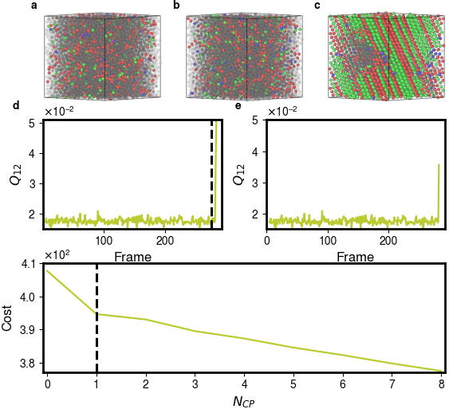
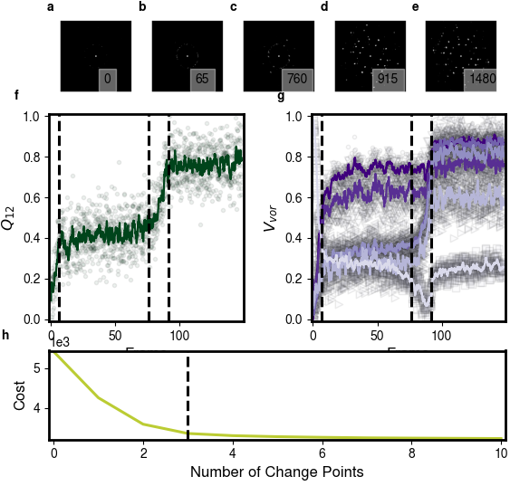
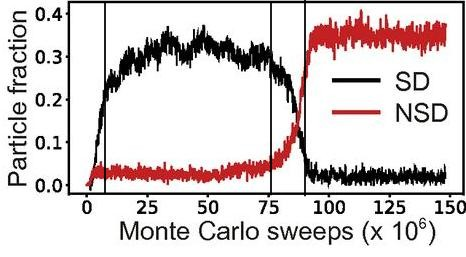
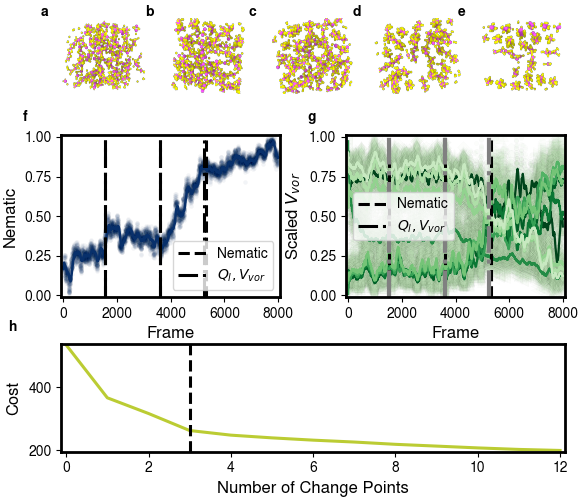

.. examples

Examples
========

.. _wca-text:

Nucleation and growth of an FCC crystal of point particles
----------------------------------------------------------

This example involves a system of :math:`N = 8000` point particles interacting via the pair-wise, purely repulsive Weeks-Chandler-Anderson (WCA) potential [`1`_, `2`_] undergoing a phase transition from a liquid to a face-centered cubic (FCC) crystal.
Using MD, the system was first equilibrated in the liquid phase at high temperature :math:`T`, after which it was quenched to low :math:`T` and run for 143 million time steps at fixed :math:`N, T` and fixed pressure :math:`P` (:math:`N = 8000, T=0.0025, P=0.772` in reduced units).
Following the quench, the system nucleated a crystalline cluster of :math:`FCC`, which subsequently grew to encompass the entire simulation box.

To *generate* the signal we computed the Voronoi polyhedron volume [`3`_, `4`_] and MSM [`5`_] for spherical harmonics :math:`l = 2, 4, 6, 8, 10, 12` for each particle.
For each feature, we *map* to two distributions --- itself (no transformation) and the Voronoi tessellation neighbor average [`6`_].
We then *reduced* each distribution (raw and averaged) to six features: the 1st, 10th, and 100th greatest and least values.
After *reducing*, the MSM for each :math:`l` produces twelve features, six from the raw distribution and six from spatial averaging.
Following *aggregation*, we *transform* the signal via feature selection through a mean-shift filter with sensitivity of :math:`1e{-4}`.
Finally, we *detect* the change points using :math:`C_1` with ``rupture``'s dynamic programming algorithm, using ``kneed`` for elbow detection with a sensitivity of 1, for :math:`|K| \in [1, 10]`.
We display the results of the CPD in :ref:`wca-fig`.

We find that our method correctly detects the change point, as shown in :ref:`wca-fig`.
:ref:`wca-fig` (e, f), shows that ``dupin`` requires at least two frames after the event has started to detect the transition.
At the first frame after nucleation, the cost function is not sufficiently decreased to detect an elbow.
Even though we are two frames past nucleation when detecting the change point, ``dupin`` correctly detects the nearest frame at which a local particle density fluctuation has yet to lead to nucleation and crystallization.
In other words, the detected change point is the frame preceding nucleation ensuring the entire event was captured.

.. _wca-fig:

    Figure 1

    Change point detection applied to a particle trajectory from an MD simulation of a system of particles interacting with a WCA pair potential.
    Over the course of the trajectory, the system undergoes a phase transition from a liquid to a crystal.
    (a-c) Images corresponding to the 10th, 281st and 282nd frames in the simulation (frames chosen to show the rapid transition to FCC).
    Particles are colored according to their structure as determined by polyhedral template analysis (translucent black: None, green: FCC, red: hexagonal close packed, blue: body centered cubic).
    (d) Plot of MSM :math:`l = 12` with two frames into the transition (i.e. last frame is 283rd).
    The black dashed line is the change point determined by ``dupin``.
    (e) Plot of MSM :math:`l = 12` with one frame into the transition.
    The y-axis is identical to (e) to allow comparison.
    Note that no change point is detected in this plot.
    (f) Plot of the cost associated with the optimum :math:`m` change points computed on all features from (d).

.. _tt-text:

Entropic self-assembly of truncated tetrahedra into a 432-particle unit-cell crystal
------------------------------------------------------------------------------------

Here we look at a single component system which forms a highly complicated 432 particle unit-cell crystal (Pearson symbol cF432)[`7`_].
The particles are perfectly hard truncated tetrahedra, simulated using HOOMD-blue's hard particle MC module.
The system is simulated in the canonical ensemble with (:math:`N_p=8,000, \phi=0.615`, where :math:`\phi` is the particle volume fraction).
This trajectory is taken from Ref [`7`_].
The system is known to assemble in two steps via a high density fluid intermediate with local ordering.

The event detection proceeds with the same steps as in :ref:`wca-text`.
:ref:`tt-fig` visualizes the system and the detection of the two step nucleation process which finds 3 change points.
While we normally would expect four change points for a two step nucleation (the beginning and end of both steps), the system is never in equilibrium in the initial fluid and immediately forms the liquid precursor.

As further validation, we show in :ref:`tt-fig` (a-e) that the diffraction pattern begins with no discernible peaks, develops barely detectable peaks in part (c) and obtains obvious peaks in the diffraction pattern of (d-e).
The diffraction patterns match expectations as the intermediate motif does not result in long range ordering, but the final crystal structure does.
Finally, we show a plot, :ref:`tt-original`, from Lee, Sangmin *et al.* [`7`_] that shows the intermediate and final structure system fractions across the simulation.
The plot clearly shows that ``dupin`` detects the relevant changes without providing any direct information on the motifs.

.. _tt-fig:

    Figure 1

    Change point detection applied to truncated tetrahedra trajectory.
    (a-e) Images are the diffraction pattern (at the same orientation) at different points in the simulation (the beginning, location of the change points and the end).
    (f) Plot of the sole MSM :math:`l=12` feature that made it through the mean-shift filter along with the detected change points (dashed black vertical lines).
    (g) Plot of the Voronoi polyhedra volume features that made it past the mean-shift filter along with the detected change points (dashed black vertical lines).
    (f-g) Solid lines are the (rolling mean) smoothed features and the translucent dots are the actual data points.
    The smoothing is purely for visualization and all calculations were done using the actual data points, explaining the *shift* in change points.
    When looking at the points rather than the lines the change points fall in line with what a human observer would mark as change points.
    (h) Plot of the cost associated with the optimum :math:`n` change points computed using features that pass through a mean-shift filter.
    Note that the curve looks nearly flat from :math:`n=3` on.

.. _tt-original:

    Figure 2

    Figure is taken from Ref [`7`_] (black vertical lines added).
    Shows the fractions of the intermediate motif and final crystal across the MC simulation of truncated tetrahedra.
    Change points are shown as black vertical lines and are at 6.5, 76 and 91.5.
    Black lines are approximately located and were placed by eye.

.. _becl-text:

Assembly of :math:`\text{BeCl}_2` ions to a nematic fluid and crystal
---------------------------------------------------------------------

The system we analyze is an ionic system of 576 beryllium and chlorine ions that form ionic chains under the simulated conditions.
The simulation was carried out using an in-house molecular dynamics code that implements polarizable ion mode [`8`_] parametrized for :math:`\text{BeCl}_2` [`9`_].
MD simulations were performed in canonical ensemble with integration time step of 0.6 fs.
The starting crystal configuration placed in a 28.8Å cubic box was melted at 2000K for 4000 time steps (2.4 ps).
Following melting, the system was brought down to target temperature of 550K and simulation was run for further 1.2 million time steps (0.72 ns).
The ionic chains undergo an isotropic to nematic fluid to crystal transition (system is in solid-fluid equilibrium at the end of the simulation).

To *generate* features, we compute the nematic order parameter using the bond vector between neighboring Be atoms in a chain as the orientation vectors.
The nematic order parameter is then *aggregated* and *detected* without a *transformation step*.
The *detector* is the same as the subsection above.
We also *generate* the features used in :ref:`wca-text` in a separate pipeline to compare results.
This second pipeline has identical *map* through *detect* steps as the previous subsection.

:ref:`becl-fig` illustrates the event detection.
Part (f) shows that the nematic order parameter undergoes multiple plateaus that are separated by periods of increasing nematic order.
``dupin`` finds three change points corresponding to plateaus of low, intermediate and high nematic ordering.
:ref:`becl-fig` (a-e) visually validates this partition.
Part (a) shows little orientational preference in chain orientation; parts (b-c) show light nematic ordering; and parts (d-e) show strong nematic ordering as expected from part (f).
The last change point, :ref:`becl-fig` part (d), doesn't seem to be as crystalline as part (e), but this is due to the crystal requiring strong nematic order and proper orientation of the chains.
When looking at Voronoi polytope volumes and MSM in :ref:`becl-fig` (g), only Voronoi volumes and MSM :math:`l=2` make it past the mean-shift filter.
The features of part (g) are very noisy and result in only one change point near the 3rd change point from the nematic order parameter.
The failure for the MSM and Voronoi polytope volumes to correctly partition the simulation highlights the need for informative parameters in event detection.

.. _becl-fig:

    Figure 1

    Change point detection applied to ionic beryllium chloride trajectory.
    (a-e) Images corresponding to different points in the simulation (the beginning, location of the optimal change points, and end).
    Particles are colored according to type Be (pink) and Cl (yellow) while bonds are colored a darker pink.
    (f-g) The black dashed vertical lines are the change points from the nematic order parameter.
    The black dotted dashed vertical lines are the change points from the reduced MSM and Voronoi volumes that passed a mean filter.
    Solid colored lines are the (rolling mean) smoothed feature and the translucent dots are the actual data points.
    The smoothing is purely for visualization and all calculations were done using the actual data points.
    (f) Plot of nematic order parameter.
    (g) Plot of scaled Voronoi volumes.
    (h) Plot of the cost associated with the optimum :math:`n` change points computed (only for the nematic order parameter).

References
----------

- John D. Weeks, David Chandler, and Hans C. Anderson. *J. Chem. Phys.*. (1971). [`1`_]
- David Chandler, John D. Weeks, and Hans C. Anderson. *Science*. (1983). [`2`_]
- Georges Voronoi. *Crelles Journal*. (1908). [`3`_]
- Georges Voronoi. *Crelles Journal*. (1908). [`4`_]
- Walter Mickel *et al.* *J. Chem. Phys.* (2013). [`5`_]
- Wolfgang Lechner and Christoph Dellago. *J. Chem. Phys.* (2008). [`6`_]
- Sangmin Lee *et al.* *PNAS* (2019). [`7`_]
- Mark Wilson, Paul A. Madden, and Benedito J. Costa-Cabral. *J. Phys. Chem.* (1996) [`8`_]
- Mark Wilson and Paul A. Madden. *Molecular Physics*. (1997) [`9`_]

.. _1: www.doi.org/10.1063/1.1674820
.. _2: www.doi.org/10.1126/science.220.4599.787
.. _3: www.doi.org/10.1515/crll.1908.133.97
.. _4: www.doi.org/10.1515/crll.1908.134.198
.. _5: www.doi.org/10.1063/1.4774084
.. _6: www.doi.org/10.1063/1.2977970
.. _7: www.doi.org/10.1073/pnas.1905929116
.. _8: www.doi.org/10.1021/jp9512319
.. _9: www.doi.org/10.1080/002689797170400
