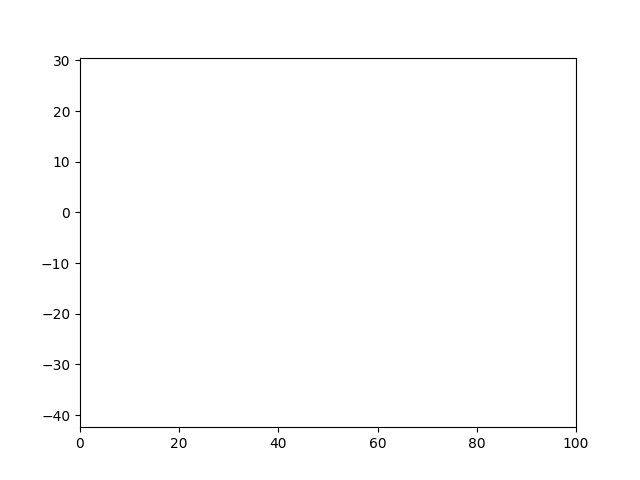

.. include:: ../README.rst
   :start-line: 0
   :end-line: 42

.. image:: _static/scheme.png

.. include:: ../README.rst
   :start-line: 44
   :end-line: 47

.. literalinclude:: example.py

.. include:: ../README.rst
   :start-line: 51

Table of Contents
=================

.. toctree::
   :maxdepth: 1
   :caption: Contents:

   installation
   tutorials
   contributing
   authors
   changelog
   citing

.. toctree::
    :maxdepth: 1
    :caption: API:

    module-data
    module-detect
    module-preprocessing

Indices and tables
==================
* :ref:`genindex`
* :ref:`modindex`
* :ref:`search`
