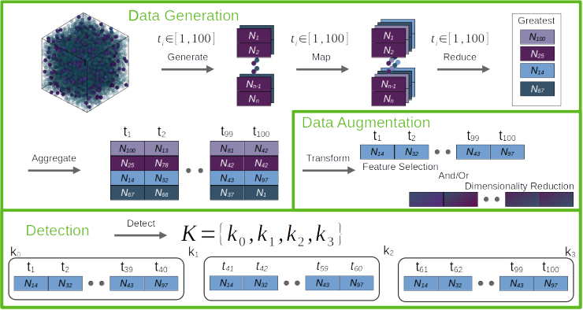

========
Pipeline
========

**dupin** is based around a six step model going from a raw simulation in the form of a trajectory into a set of change points defining the boundaries of events in a molecular simulation.

The steps are:

1. Generate - Generates descriptors for which change points are to be detected.
2. Map - Transform the generated data into different quantities using various functions  e.g. neighbor point averaging.
3. Reduce - Take the non-scalar features and create scalar features from them.
4. Aggregate - Perform the steps 1-3 across the time dimension on trajectory to obtain a signal on which detection will be performed.
5. Transform - Transform the signal to reduce redundant dimensions and reduce dimensionality of the signal for faster detection.
6. Detect: Given the final signal detect events if any in the data.

All steps besides Generate (1.), Aggregate (4.), and Detect (6.) are optional depending on the circumstances.
For instance, if using the Nematic order parameter to detect a nematic transition, there would be no need for step for reduction (3.).

Data Generation
---------------

Variables describing the particular feature of the system that correlates with (or that is) property of interest which we seek to detect must be computed as a function of the trajectory.
A variety of features can be calculated and fed into the change point detection algorithms.
Each feature can be a global scalar value or a vector describing the system.
These are often quantities that are not directly observable in a simulation, but are derived from the simulation data.
For example, the Steinhardt order parameters or coordination numbers are derived quantities that describe local environments of particles from the particle positions.
These would allow detection of events for which local structure of the system changes.

Maps and Reducers
-----------------

Maps and reducers are used to transform the data collected in the previous step into a form that is more amenable to change point detection.
For example, the Steinhardt order parameters are a vector of values describing local particle environments for each particle.
However, for change point detection, it is more useful to have a single value for each frame.
This can be accomplished by using a reducer such as the maximum value of the Steinhardt order parameters across all particles.
This would then result in a single value for each frame.
More complex reducers can be used to reduce the dimensionality of the data while still retaining the information necessary to detect a change point.
Alternatively, maps can be used to transform the data into a new form.
For example, the Steinhardt order parameters can be averaged across all neighboring particles for each particle, obtaining a new flavor of order parameter that might be able to describe structural ordering on larger length scales.
The result is another vector of per-particle properties capable of describing different structural features.
Maps are always used before reducers, but might not be necessary.
However, when vector per-particle properties are used reducers must be used.
These reducers rely on the fact that only a few features of the distribution are necessary to detect a transition (namely those at the extremes of a distribution).

Aggregation
-----------

Aggregation refers to a process of accumulating time-dependent data across the whole trajectory.
The desired properties are computed, mapped and reduced according to the pipeline set up in previous steps.

Signal Transformation
---------------------

Transform the signal using signal processing into a new feature signal (essentially the map step applied in the time direction).
This step can involve feature selection or dimensionality reduction.
The goal is to reduce the dimensionality of the signal while retaining the information necessary to detect a change point.
This step is optional, but can improve the performance of the change point detection algorithms.
In this step, parts of signal with high correlation and/or uninformative dimensions are filtered out.

Detection
---------
Detect change points in the signal.
This step is the most important and is the ultimate purpose of this package.
The goal is to detect change points in the signal that correspond to events in the analyzed trajectory.
The change points are detected using a variety of algorithms.
Often times, number of events is not known beforehand.
Dupin also has capabilities for detecting optimal number of change points using elbow detection.
